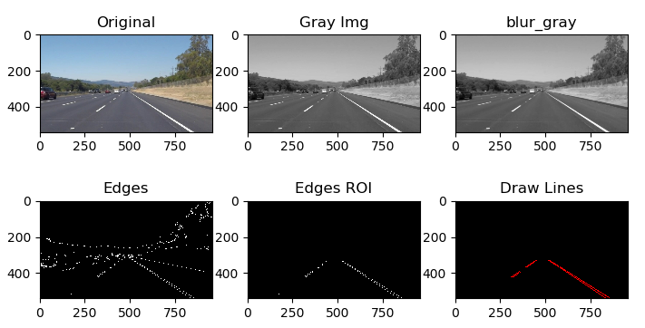
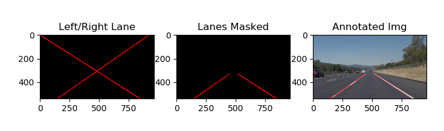

# **Finding Lane Lines** 

Overview
---
This is Udacity Self-Driving Car Engineer project
The project original [repository](https://github.com/udacity/CarND-LaneLines-P1.git)

You could also to refer the Udacity_README.md file.

### Project
The **project_report.md** include the summary of the project.
Below is the two picutures illustatet the process to handle the image
1. The process detect the Lines

2. The process draw the Lanes

### Files
The code is runnig in Jupyter note book.
The package list is in **package-list.txt**.

**test.py** include two function at the end.
**test_image()** is use to adjust the paramter, it will show all the internal pictures.

**test_images()** is use to check if the adjust paramter work for all the select images.

**test_challenge** is same structure as test.py but for the project last challenge veido.

### Folders
**test_images_output** include the images which applied the code.
the **raw** sub folder include the picture which just has detected lines.

**test_videos_ouput** include the videos which Lanes drawed.
the **raw** sub folder include the videos which just has detected lines.