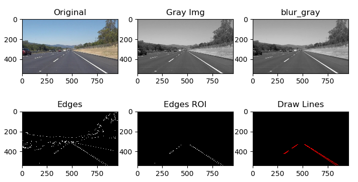

# **Finding Lane Lines on the Road** 

---

**Finding Lane Lines on the Road**

The goals / steps of this project are the following:
* Make a pipeline that finds lane lines on the road
* Reflect on work in a written report

---

### 1. The pipeline.

Pipeline as below:
1. convert the image from RGB image to gray
2. use gaussian_blur fucntion to blue the grayscale image
3. use Canny() function to detect the edges
4. use mask to get the ROI(region of interest) of edge
5. use Hough function to find lines in the ROI area
6. draw the left/right lane(detail in below) 

### 2. Draw the Lanes

1. use Hough fucntion to get the lines(returned as points)
2. split the line as left and right according their slope.
3. Noise handle, get rid of the horizental line use which abs(slope) is < 0.5)
4. check the left/right lines and exclude the outlier(10% different with mean slope)
5. fit the left/right(x, y points) in one line use np.polyfit(y,x,1)(Note, need use y(top line 0/bot line(image height)) to predict x )
6. get top/bot points of the lane and draw it, mask to ROI
7. combine the lan with oringal image

### 2. Identify potential shortcomings with your current pipeline

1. the ROI area is hard coded, if there is change in car direction, it will be fail
2. the road surface is consistency, no change in gray/color will be detect as line.
3. not varified if the lighting condistion will affect the pipline.

### 3. Suggest possible improvements to your pipeline

1. scan the whole picture for the ROI area.
2. use slope(k) limitation should get rid of most of the noise line which is not belong to the Lane
3. adjust the Canny(), Hough() function parameter dynamiclly according the lighting condition.

## Challenge:

### 1.Get the image to handle with
Get the frame from the video.
Frame could get use the clip object.save_frame() function. refer to the link
[stackoverflow](https://stackoverflow.com/questions/43148590/extract-images-using-opencv-and-python-or-moviepy)

### 2.Adjust the ROI
the left side and the right Lane car will cause noise lines.
use proper ROI to avoid the noise.
The blue line is the ROI area

### 3. Adjust the the paramter to avoid the noise
through paramter adjust and exclude the lines who's slope is abnormal, in the most situation, the code work.

### 4. Not solved, the right Lane will be a little joggle
At 4.0s and 5.9s, in the vedio, the Lane joggle
there are two reason, the Lane it self is not a strait line and there are extra noise line which parallel with Lane itself
Below two picture is the frame at 4.0s and 5.9s with detect lins

 

Below is two picture is the Lane drawed and not 100% aligned.

 

Pictures not compressed could be found at folder **test_images_output_challenge**

Currenlty dont' have a solution for this issue.